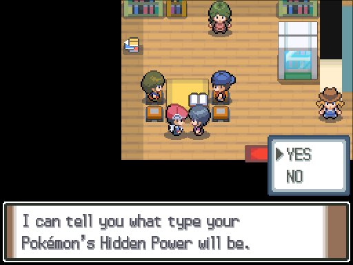
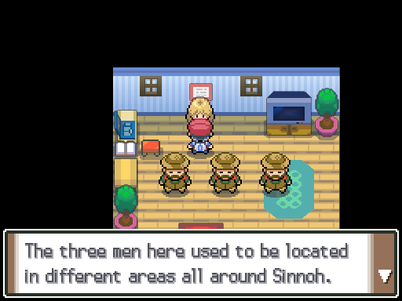

# NPC Changes

## Changed trades

See [here](trade_changes.md) how the trades are changed.

## Evolution Item Seller (New)

**Location:** Snowpoint City

- The top left house is now occupied by an NPC who will sell evolution items to you.
- She only sells items that are not available in the Veilstone Dept. Store or the Game Corner.
- One of any item will cost you $10,000.

## Hidden Power Teller (New)

**Location:** Jubilife Trainers' School

- An NPC has been placed in the school who can tell you what type a Pokémon's Hidden Power will be.
- The power of Hidden Power is still based on IVs in Renegade Platinum - the NPC unfortunately cannot tell you this.
- The Hidden Power teller is still in Veilstone City as well.

## Item Fanatic (New)

**Location:** Floaroma Town

- The house to the right of the Pokémon Center contains the "Item Fanatic".
- Talk to him and he'll mention that he can give you items only particular Pokémon can use.
- Talk to him with a [Pikachu] in your party to get a Light Ball.
- Talk to him with a [Farfetch'd] in your party to get a Stick.
- Talk to him with a [Cubone] or Marowak in your party to get a Thick Club.
- Talk to him with a [Chansey] in your party to get a Lucky Punch.
- Talk to him with a [Ditto] in your party to get a Quick Powder and Metal Powder.
- Talk to him with a [Clamperl] in your party to get a Deep Sea Tooth and Deep Sea Scale.

## Move Deleter

**Location:** Oreburgh City

- The move deleter has moved into the house left of the Pokémon Center in Oreburgh City.
- No other changes.

## Move Relearner

**Location:** Pastoria City

- The move relearner is in the same place as before.
- Heart Scales or any payment is no longer required - just speak to him to learn some moves.

## Move Tutors

**Location:** Route 212 (South)

- The move tutors from Route 212, Snowpoint City and the Survival Area are now all present in the house on Route 212.
- Shards or any payment is no longer required - just speak to them to learn a move.

## Rare Berry Seller (New)

**Location:** Route 208

- The house just left of the gatehouse to Hearthome City where the Berry Master lives now has a female scientist NPC.
- This NPC will sell you rare berries that can't be obtained in Platinum normally, such as the Liechi and Salac Berries.
- Each berry can be bought infinite times but will cost $10,000 per purchase.

## Training NPCs (New)

**Location:** Solaceon Town

- The training NPCs are a new set of NPCs found in the Solaceon Day Care.
- The Cowgirl on the right will offer you training for either experience or a particular stat.
- The Farmer on the left will sell you a bundle with 15 of each EV reducing berry for $5,000.

### Experience:

- Choosing experience will pit you against a team of Chansey or Blissey at the chosen level.
- The Chansey or Blissey all only know Healing Wish and hold a Toxic Orb.
- You gain access to higher levels of experience training as you progress.
- Lv. 35 is unlocked when Maylene is beaten.
- Lv. 45 is unlocked when you reach Celestic Town.
- Lv. 55 is unlocked when Candice is beaten.
- Lv. 65 is unlocked after completing Victory Road.
- Lv. 75 is unlocked after becoming Champion.
- Lv. 85 is unlocked after completing the Stark Mountain events.

### Stats:

- Choosing a stat will ask you to select Low, Medium or High.
- Choosing Low will pit you against a team of Level 10 Pokémon who give 1 EV of that stat each.
- Choosing Medium will pit you against a team of Level 10 Pokémon who give 2 EV of that stat each.
- Choosing High will pit you against a team of Level 10 Pokémon who give 3 EV of that stat each.

[Pikachu]: ../pokemon_changes/025/
[Farfetch'd]: ../pokemon_changes/083/
[Cubone]: ../pokemon_changes/104/
[Chansey]: ../pokemon_changes/113/
[Ditto]: ../pokemon_changes/132/
[Clamperl]: ../pokemon_changes/366/
